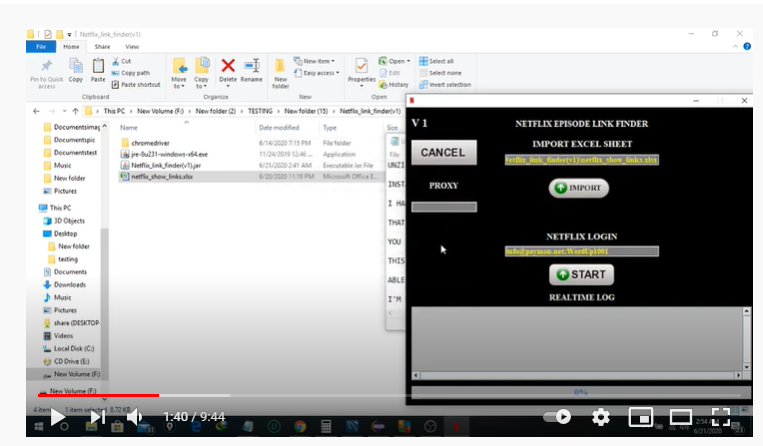

# Netflix-Automation

### User story/ User requirements:

The user wanted an automated solution that can scrape episode data from Netflix.

### Steps to automate:

* Import an excel sheet containing the link to Tv series
* Log into Netflix with inserted username, password.
* Go to the Tv series link found in the Excel sheet.
* Calculate the total number of seasons.
* Select a season and collect each episode data
* Continue until all the season has been done.
* Move to a new Tv-series from the Excel sheet
* Continue until all Tv-series have been scraped.

### Test Cases:

https://docs.google.com/spreadsheets/d/1hEhIRDhrGaT-UL6e7ilhUkWJ9PYKSxmhG9KwUhKb7qU/edit?usp=sharing

### Final result :

